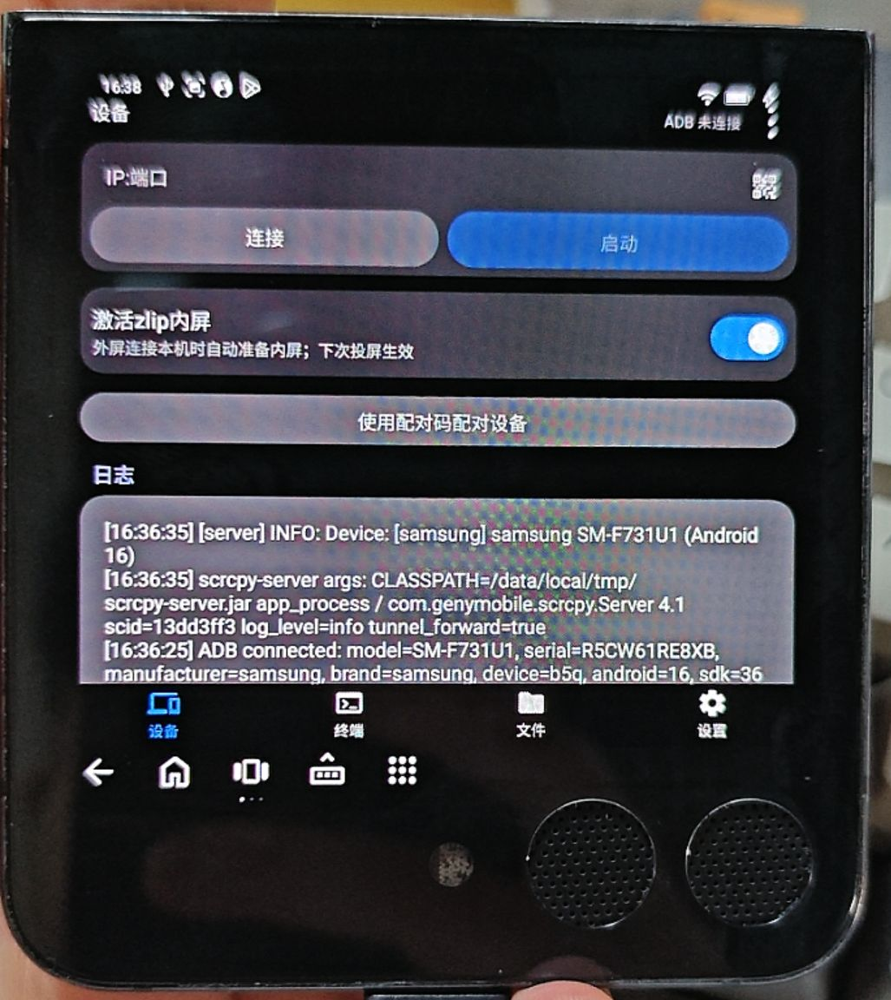
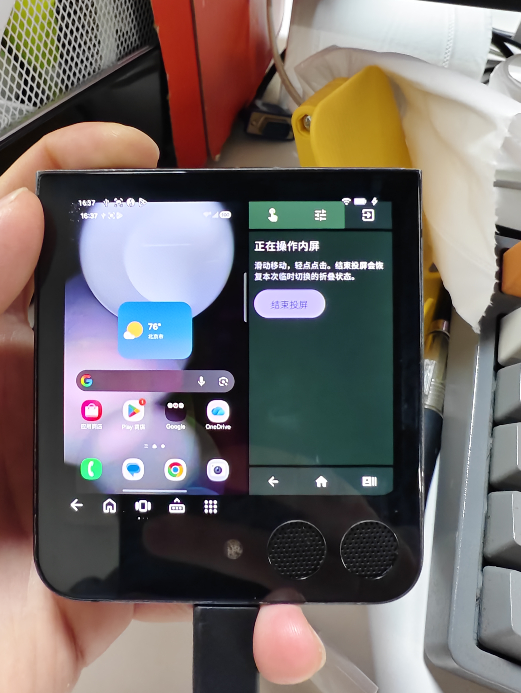
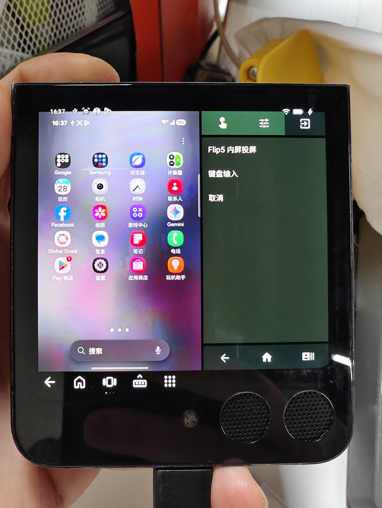

<!-- markdownlint-disable MD033 -->

# Scrcpy for Android · 三星 Galaxy Z Flip5 专用版

<a href="https://github.com/Genymobile/scrcpy/blob/master/app/data/icon.svg" title="Modified from the original version">
  
</a>

[scrcpy](https://github.com/Genymobile/scrcpy) android client

**本分支专为三星 Galaxy Z Flip5 设计**，重点适配 720×748 外屏，让合盖时也能在外屏查看和操控本机内屏。内屏一键投屏功能仅对三星 `SM-F731*` 机型启用；其他机型不在本次专用适配与验证范围内。

从通过
[ADB Wireless](https://developer.android.com/tools/adb?hl=zh-cn#connect-to-a-device-over-wi-fi)
连接的 Android 设备镜像视频与音频，并允许使用触摸屏与键盘鼠标进行控制

不需要 root 权限，也无需在设备上安装应用程序

> [!NOTE]
> 本项目基于 scrcpy，但并非其官方版本，与原作者及维护团队不存在任何隶属或合作关系

## 本次修改效果（Galaxy Z Flip5 真机）

以下为本次修改的真机实拍：外屏紧凑设备页、合盖操作内屏，以及投屏工具菜单。点击图片可查看原图。

<p align="center">
  <a href="pics/pic1.jpg"></a>
  <a href="pics/pic2.jpg"></a>
  <a href="pics/pic3.jpg"></a>
</p>

<p align="center">外屏设备页 · 内屏投屏运行状态 · 投屏工具菜单</p>

## 下载

[下载最新 Flip5 专用 Release APK](https://github.com/xiaomaoju/ScrcpyForAndroid/releases/latest)（ARM64）。推送到主分支后自动构建发布，安装包与 SHA256 校验文件均在 Releases 页面。

## 本次改动概览

- **外屏紧凑界面**：针对 Flip5 外屏重新排布设备、配对、终端、文件和设置页面，连接与启动操作常驻，参数独立滚动；固定外屏字号，并避让系统栏、圆角、缺口和输入法。
- **自适应投屏与操控**：窄画面采用左侧视频、右侧触控板或软件详情的双区布局；宽画面自动切换为五键侧栏，也可手动切回双区。视频始终完整等比显示，支持直接触摸、相对鼠标、双指滚动、长按拖动和键盘输入，修复短暂双指接触后鼠标无法继续移动的问题。
- **一键内屏投屏**：新增外屏小组件“Flip5 内屏投屏”、控制中心“内屏投屏”快捷按钮，以及设备页默认开启并持久保存的“激活zlip内屏”开关；兼容阿田 `.AutoCastActivity` 入口，复用已有会话。
- **统一连接与配置**：支持本机无线调试发现、通知输入配对码和回环连接；各启动入口共用当前全局/预设配置及自定义服务端，动态读取内屏尺寸，不写死内屏分辨率。
- **结束恢复与故障诊断**：停止、断开或启动失败时统一清理本次双屏状态，增加恢复守卫和可复制的分阶段诊断。`flip5.11` 修正合盖结束时的外屏休眠问题，结束后返回软件主界面，并接管外部入口预先开启的双屏清理。

外屏 UI 适配保留原有内屏界面，不修改系统分辨率或 DPI；一键内屏投屏会临时准备双屏状态，并在结束时解除覆盖。普通全屏页的“退出”返回设备页并保留投屏，“结束投屏”则停止专用会话。

当前仍为实验版。已有 SM-F731U1 真机记录确认阿田入口启动、合盖结束后返回主界面且外屏保持亮起；普通卡片直接启动仍有窗口被系统抢占、首帧超时的已知问题，物理展开、锁屏及所有入口的完整回归尚未完成。详细功能见下方 [Galaxy Z Flip5 外屏适配](#galaxy-z-flip5-外屏适配)，各项验证范围见 [测试版说明](dist/README.md) 和 [自适应布局说明](dist/flip5-adaptive-layout.md)。

## 上游功能截图

<p align="center">
  
  
  
  
  
  
  
  
  
  
</p>
<p align="center">
  
  
</p>
<p align="center">
  
</p>

## Features

- 控制时可拉起本机输入法，且支持输入中文
- 剪贴板同步
- 低延迟音频链路 (默认未启用)
  - 受控设备播放 `USAGE_MEDIA` 流时 ([namidaco/namida](https://github.com/namidaco/namida)) ，两设备的音频延迟只差半拍 (没有具体测量能力)
  - 受控设备播放 `USAGE_GAME` 流时 (明日方舟 Bilibili 服) ，仍存在 100~200ms 的有感延迟
- 带生物认证的锁屏密码自动填充 (入口位于虚拟按钮中)
- 多配置切换，设备绑定配置，连接后直接进入全屏
- 可替换 scrcpy-server
- 利用 mDNS 服务实现自动连接启用无线调试的设备、自动发现等待配对设备的IP与端口
- 二维码配对
- 自动横竖屏切换
- 横屏布局
  - 仅屏幕比例小于 16:9 的设备
- 全屏下映射返回键到远程
- 画中画
- 双向文件传输
- 流式 adb 终端
- 内置录制

## Galaxy Z Flip5 外屏适配

### 一键打开内屏（flip5.11 实验版）

flip5.11 修正结束后的外屏休眠与页面退出：合盖时先经过按名称识别的 `TENT` 仅外屏模式，确认状态生效后再解除覆盖。直接从双屏 reset 到 CLOSED 会触发三星 `device_folded` 休眠，此过渡避免该事件，不使用休眠后唤醒、模拟电源键或常亮补偿。结束后直接回到软件主界面，不再关闭 MainActivity。手机已经展开时跳过仅外屏过渡，直接恢复实际折叠状态。

该结束路径已在 SM-F731U1 真机验证：阿田入口进入 RUNNING 后点击“结束投屏”，返回设备主界面，内屏 OFF、外屏 ON、Awake，退出期间无新增休眠/唤醒事件。此结果限定于已测合盖退出场景；展开、锁屏及各启动路径的完整回归范围见 [测试版说明](dist/README.md)。

flip5.10 统一结束清理：每次内屏投屏都会接管本次双屏模式的关闭，包含阿田等外部入口预先准备的双屏。结束、断开或启动失败时解除状态覆盖，让合盖手机回到正常外屏状态；已展开时交回系统正常内屏显示。不会重新恢复投屏前的其他人工折叠覆盖，也不会模拟电源键。外部模式接管时只添加清理守卫，不重复请求切屏。自动激活开关关闭时，若已处于双屏模式，普通本机外屏启动也会进入这条收尾链路。

设备标签页新增默认开启、持久保存的“激活zlip内屏”。在 Flip5 外屏连接本机后，原有“启动”、连接后自动启动以及指定应用启动都会经过同一套内屏准备流程；关闭后普通启动恢复原流程。连接其他设备、USB 投屏和在内屏使用原界面不触发此准备。开关从下一次启动生效，立即点击启动也会先保存最新值。投屏参数继续读取主界面当前配置。

控制中心新增“内屏投屏”快捷按钮：在系统快捷面板的编辑页添加一次即可使用。点击时收起面板，进入与外屏卡片相同的一键入口；已运行时回到原会话，不重复连接，也不作为停止开关。锁屏时先由系统解锁。控制中心和卡片均遵循“激活zlip内屏”设置；关闭且外部没有准备双屏时按原配置直接投屏，关闭且外部已准备双屏时复用并校验捕获源。实现采用 Android [Quick Settings TileService](https://developer.android.com/develop/ui/views/quicksettings-tiles)。

阿田现有 `.AutoCastActivity` 命令保持兼容，其含义仍是明确请求内屏投屏，独立于本软件“自动准备”开关。已准备好的双屏直接复用并接管结束清理；如果它先强制停止旧进程，导致旧恢复守卫撤销了新覆盖，则在清理旧租约后重新准备并验证。不会因开关关闭而将这个明确的内屏请求降级为外屏捕获。普通入口、卡片和控制中心使用同一进程级操作，停止、断开会等待该操作解除本次双屏状态。

flip5.8 修复诊断确认的 `D1` 尺寸误判：SM-F731U1 已进入双屏模式，主屏报告为 1080×1920、外屏窗口位置正确，却被旧版写死的 1080×2640 条件拦住。现在动态读取内屏尺寸，以双屏状态、显示器编号和窗口位置确认捕获目标；启动视频前再次检查双屏模式仍生效。画面与输入坐标继续随视频流实际尺寸更新，保留手机当前的系统分辨率和密度。

小卡片是启动入口，与主界面共用 `ScrcpyLaunchSettings` 配置解析，复用当前全局/预设配置及自定义服务端。连接重建前确定本次预设，避免连接重置把它换成默认值。码率、帧率、编码、音频、剪贴板、电源等投屏选项读取主配置；最大尺寸未设置时使用当前源尺寸，用户设置了上限时按该上限编码。入口负责本机连接、双屏准备、外屏窗口和结束时的恢复。主配置若选择摄像头、虚拟屏、其他显示器或关闭视频显示，会明确提示不适用于“打开内屏”，保留原配置。

错误保留分阶段诊断：`P1` 为主配置读取/适用性检查，`F1–F4` 为折叠状态读取/切换，`W1` 为恢复外屏窗口，`D1` 为内外屏状态检查，`D2` 为捕获源和双屏状态复核，`V1–V2` 为视频启动/首帧。失败页点“复制诊断”，可取得失败前的配置摘要、屏幕 ID、模式尺寸、亮屏状态、窗口位置、折叠状态和帧计数；上次失败记录保存在本机，可从内屏设置入口再次复制。报告不包含配对码、屏幕画面或设备序列号。完整真机出画面及防套娃效果仍待验证。

flip5.5 已收到真机反馈：点击卡片后约一秒黑屏，展开也未恢复，请停用该版本的一键入口。flip5.6 针对此问题调整启动顺序：确认双屏状态后等待切换，再通过 ADB 将窗口重新拉到检测到的外屏，确认外屏已亮起后才启动捕获。切换期间的系统熄屏广播、旧窗口移除不会提前结束这次启动；用户点返回或结束仍可取消。此修订尚未通过 Flip5 真机验证，不能据此宣称黑屏已解决。

新增三星外屏小组件“Flip5 内屏投屏”。合盖后点击“打开内屏”，自动连接本机、准备双屏状态并进入现有双区操控；已有专用会话则直接继续。首次从软件设置页进入“Flip5 内屏投屏”，启用无线调试，在系统“使用配对码配对设备”窗口保持打开时，从本软件通知输入六位配对码。软件只发现本机服务并通过回环地址配对、连接，无需填写 IP 和端口。随后在系统“设置 → 外屏 → 小组件”添加卡片。通知权限只用于首次配对输入和会话控制；授权失效时卡片进入修复流程。

此入口仅允许 `SM-F731*` 三星 Flip5。它按系统返回的名称寻找双屏状态，等待生效后核对主屏、外屏播放器位置和捕获源；不会把状态编号 `4` 或动态显示 ID `53` 当成通用规则。要求主配置选择默认屏或经过核验的主屏 `0`，不会回退到外屏或虚拟屏。旧的本机手动投屏会先停止，再按新状态建立会话；其他设备的活动投屏不会被自动替换。收到新解码画面并完成显示后才进入“正在操作内屏”。

“结束投屏”、真正锁屏、展开或设备状态改变会停止专用会话，并解除本次双屏状态覆盖。独立于应用进程的 ADB shell 守卫在连接关闭、10 秒无心跳、启动超过 25 秒未确认首帧或物理折叠状态改变时尝试恢复；启动心跳不能延长首帧期限。恢复优先于播放器销毁；应用侧启动看门狗也会恢复状态并断开卡住的 ADB 握手。恢复失败会保留恢复记录并提示重试。外部启动器预先设置的双屏也使用同一个清理守卫，终止时不再保留该覆盖。

兼容外部快捷动作入口 `.AutoCastActivity`，它是指向 `MainActivity` 的别名，复用 `AppRuntime` 会话。**One UI 8.5 的真实折叠、外屏启动策略和防套娃效果尚待 Flip5 真机验证；模拟器通过并不等于此项验证通过。** 安装包与验证范围见 [测试版说明](dist/README.md)。

双屏本机投屏增加内容渲染、视频编解码和显示负担；内屏面板实际亮起时还会增加面板功耗，不能在未测量时给出耗电百分比。结束清理不以节能效果为条件：每次解除本次双屏覆盖并停止投屏会话，交回系统按真实折叠状态处理。参考 APK 的投屏命令没有结束清理命令，其熄屏广播切到状态 1 的逻辑也不能等同于监听投屏退出，因此现在由本软件统一收尾。

专用模拟器上的恢复守卫验证（只允许 `ranchu`，需预先让模拟器自身 ADB 监听 5555）：

```bash
ANDROID_SERIAL=<专用模拟器序列号> sh gradlew :app:connectedDebugAndroidTest -PabiList=arm64-v8a \
  -Pandroid.testInstrumentationRunnerArguments.class=io.github.miuzarte.scrcpyforandroid.AutoCastGuardInstrumentedTest \
  -Pandroid.testInstrumentationRunnerArguments.autoCastGuard=true
```

### 现有手动投屏界面

交互原型：[双区投屏方案 V3](dist/flip5-control-preview.html) · [全局 UI 预览 V1](dist/flip5-ui-preview.html)。两者均为内嵌样式、脚本和参考外框的独立 HTML 文件，连接与投屏使用演示数据，不代表真机验证结果。

Android 测试版 `0.6.6-flip5.4` 已实现外屏紧凑操作页与双区全屏投屏页，并修复短暂双指接触后鼠标停止移动的问题（[修复验证](dist/flip5-mouse-fix.md)）。连接地址、连接和启动在同屏常驻，参数独立滚动。**原软件界面保留：连接并开始投屏后，点击原有「全屏」入口打开；右上角「退出」直接返回设备页，保持投屏会话。** 只有原配置启用「开始后全屏」时才自动打开。停止、断开仍使用设备页原有操作与配置。

左侧根据实际视频分辨率完整等比显示；1080×1920 只是原型示例，不覆盖内屏分辨率。触摸模式直接操作左侧，鼠标模式通过右侧相对触控板移动、轻点点击、双指滚动、长按拖动。右侧「详情」承载原软件的设备、终端、文件、设置与子页面，顶部页名可切换页面；软件返回与底部远端返回/主页/最近任务分开。切换触控板与详情保留软件页，输入法出现时画面随剩余区域缩小。

- 识别当前显示器的 720×748 物理面板（支持横竖方向），布局使用当前窗口的 dp 尺寸。内屏、小窗或键盘造成的短窗口不会仅因宽高比触发外屏模式。
- 外屏按中文固定字号排版，不跟随系统大字体；36dp 主按钮、36–40dp 导航、两行连接区、紧凑配对表单、一排终端快捷键、48dp 文件条目。主操作无需滚动；参数、长列表和说明可滚动。原有内屏布局、系统字号及保存的显示偏好保持不变。
- 外屏内容遵循系统报告的缺口、圆角、系统栏和输入法区域。投屏按原比例完整显示，控制栏单独留位；画面与触摸共用尺寸计算。1080×2640 的内屏画面在未扣安全区的外屏上约为 306×748，左右留黑属于正常现象。
- 本适配不修改任何显示器的系统分辨率或 DPI，也不自动更改捕获源、创建虚拟屏或开关内屏电源。需要通过现有 ADB 配对/连接流程连接本机，再选择实际内屏为捕获源，并通过外屏启动器打开客户端。
- 系统未正确报告的物理缺口无法从像素分辨率精确推断；One UI 的外屏启动、折叠后捕获源是否继续输出、内外屏任务路由和真实触摸仍需 Flip5 真机验收。模拟器只能证明布局和输入几何。

构建与适配测试：

```bash
sh gradlew :app:assembleDebug :app:testDebugUnitTest -PabiList=arm64-v8a
# 指定专用模拟器，避免操作日常设备
ANDROID_SERIAL=<专用模拟器序列号> sh gradlew :app:connectedDebugAndroidTest -PabiList=arm64-v8a \
  -Pandroid.testInstrumentationRunnerArguments.class=io.github.miuzarte.scrcpyforandroid.CoverLayoutInstrumentedTest,io.github.miuzarte.scrcpyforandroid.CoverControlInstrumentedTest
```

可选的 `CoverLoopbackInstrumentedTest` 只在显式传入 `coverLoopback=true` 的 720×748 专用模拟器上执行。它连接该模拟器自身的 `127.0.0.1:5555`，临时创建 1080×1920 视频源以检查真实会话与原软件页面；这是测试夹具行为，正式界面不会自动创建虚拟屏。测试结果及安装说明见 [测试版说明](dist/README.md)。

## 已知问题

- 刚开始串流时有概率丢失关键帧导致花屏，等待一段时间后重新接收关键帧即可
- 因为没有设备用于 (也懒得) 测试，应用可能无法正常运行在安卓版本较低的设备上，特别是画中画功能，非常取决于国产 ROM 的实现
- 关闭画中画后不会停止 scrcpy 串流，仍然需要回到应用中点击停止
- 跨设备输入中文
  - 实现方式为利用剪贴板同步，会导致受控机剪贴板历史被填充输入历史
  - 不知道为什么有时候会上屏失败
- 虚拟按键的截图实现方式为发送
`keycode 120`，安卓官方([keycodes.h#349](https://android.googlesource.com/platform/frameworks/native/+/master/include/android/keycodes.h#349))的定义为
`System Request / Print Screen key.`，不同的厂商有不同的实现，在某些类原生(`AxionOS`) 上的行为是软重启
- 切换语言后需要重启应用才能进入全屏

## TODO

\> [TODO.md](TODO.md)

## NOT-TODO

- 低版本安卓适配
  - 项目的 `minSdk` 为 26 / Android 8，98.4% 的设备都能成功安装上，~~只是出问题不管~~
  出问题了 (特别是崩溃闪退) 带 logcat 来尽量修
- 更多的文件操作，包括不限于 `删除`, `重命名` 等
  - 可以长按复制路径去终端用 `rm`, `mv`
- 录制的进一步优化
  - `MediaCodec` 限制太大，再继续做要引入 `ffmpeg`，ofc no way
- ADB 安装应用 / adb install
  - 需要大改 JNI 的实现因此不做
  - 可以推送文件之后使用终端安装或手动控制安装

## Change Log

\> [CHANGELOG.md](CHANGELOG.md)

## 建议搭配模块

- 密码锁屏无法捕获: [LSPosed/DisableFlagSecure](https://github.com/LSPosed/DisableFlagSecure)
- 开机自动启用 adb: [gist/906291](https://gist.github.com/Miuzarte/9062915f1615d5eebd363c759fda496c)

## FAQ

0. 控制不了
   - [Genymobile/scrcpy/FAQ.md#control-issues](https://github.com/Genymobile/scrcpy/blob/master/FAQ.md#control-issues)

1. 切到后台后 ADB 断连
   - 将国产 ROM 中的 `省电策略` 调整至 `无限制`
   - 将安卓原生设置中的 `允许后台使用` 启用并设置为 `无限制` (应用设置页中有入口)

2. 虚拟屏不显示输入法 / 输入法显示在主屏幕
   - 将 `--display-ime-policy` 设置为 `local`
   - 自行在悬浮球中拉起本机输入法

3. 码率只能拉到 40Mbps 嫌低
   - 每个 Slider 选项的标题都可以点开自己输入值

4. 录制/下载的文件在哪
   - /sdcard/Movies/Scrcpy/
   - /sdcard/Download/Scrcpy/

5. 横屏模式对左撇子不太友好
   - 右上角有按钮可以对调方向

6. MIUI 虚拟屏没有桌面 / 虚拟屏白屏
   - 装个第三方桌面

## 构建

### GitHub 自动发布

推送到 `main` 后，[Android Build and Release](https://github.com/xiaomaoju/ScrcpyForAndroid/actions/workflows/android.yml) 会自动运行 JVM 测试、构建并验证签名，然后发布 ARM64 Release APK 与 `SHA256SUMS.txt`。也可在 Actions 页面选择 **Run workflow** 手动发布，或推送 `v*` 标签触发。测试或构建失败时不会发布。

自动版本使用 `<versionName>-build.<运行编号>`，自动标签为 `v<自动版本>`；手动推送标签时保留标签名。CI 的 `versionCode` 为 `100000 + 运行编号`，便于后续安装覆盖升级；本地不传 CI 参数时仍使用源码版本。主分支发布会更新 Releases 的 Latest 下载入口。自动构建不代表新增真机验证，适配状态仍以本文及测试版说明为准。

签名通过仓库 **Settings → Secrets and variables → Actions** 的四个 Secrets 提供：`ANDROID_KEYSTORE_BASE64`、`ANDROID_STORE_PASSWORD`、`ANDROID_KEY_ALIAS`、`ANDROID_KEY_PASSWORD`。工作流缺少任何一项会明确失败，不会发布未签名 APK；私钥和密码不提交到仓库。迁移或 Fork 仓库时需要重新配置这些 Secrets，并保留同一签名密钥。

**首次从旧 Debug 测试版切换到 Release 时，因签名不同需要卸载旧版，请先备份应用数据。** 此后自动发布使用同一专用密钥，可覆盖升级。

### 本地构建

- JDK 21
- Android SDK (`compileSdk 37` / `buildTools 37.0.0`)
- Android NDK `29.0.14206865`

```bash
git clone --recursive https://github.com/Miuzarte/ScrcpyForAndroid.git
cd ScrcpyForAndroid
./gradlew assembleDebug
```

已克隆但没有拉取子模块：

```bash
git submodule update --init --recursive
```

specific abi:

```bash
./gradlew assembleRelease -PabiList=arm64-v8a
```

## Credits

- [Genymobile/scrcpy](https://github.com/Genymobile/scrcpy) (包括图标)
- JNI ADB 实现: [rikkaapps/shizuku](https://github.com/rikkaapps/shizuku), [vvb2060/ndk.boringssl](https://github.com/vvb2060), [lsposed/libcxx](https://github.com/lsposed/libcxx)
- 界面组件: [YuKongA/miuix](https://github.com/compose-miuix-ui/miuix)
- 界面设计参考: [tiann/KernelSU/manager](https://github.com/tiann/KernelSU/tree/main/manager), [miuix/example](https://github.com/compose-miuix-ui/miuix/tree/main/example)
- 画中画实现参考: [ClassicOldSong/moonlight-android](https://github.com/ClassicOldSong/moonlight-android)
- 原生应用设置页跳转: [YifePlayte/WOMMO](https://github.com/YifePlayte/WOMMO)
- 终端实现: [reapercanuk39/termux-kotlin-app](https://github.com/reapercanuk39/termux-kotlin-app) (仅 Apache 2.0 部分)
- 二维码生成: [nayuki/QR-Code-generator](https://github.com/nayuki/QR-Code-generator/tree/master/java)

## License

[Apache License 2.0](LICENSE)

## Star History

<a href="https://www.star-history.com/?repos=Miuzarte%2FScrcpyForAndroid&type=date&legend=top-left">
 <picture>
   <source media="(prefers-color-scheme: dark)" srcset="https://api.star-history.com/chart?repos=Miuzarte/ScrcpyForAndroid&type=date&theme=dark&legend=top-left&sealed_token=ZAxkizLKrqW0OrnbwXmuzTskU0mzMsjF--hGG8WW4F38bJGglf17mqXYZ6aQvePlP7ocCCS39PHNQYgjyLIEGcbU_8qQYXZ-YPs5N8slD0MphyJmujabc0AUKWMIpdq6iqSGifrLx-rQGBd26YTwEPikYV6SKjGVAxPhoMmMgzyJ13RtkP3rSm4-E2sN" />
   <source media="(prefers-color-scheme: light)" srcset="https://api.star-history.com/chart?repos=Miuzarte/ScrcpyForAndroid&type=date&legend=top-left&sealed_token=ZAxkizLKrqW0OrnbwXmuzTskU0mzMsjF--hGG8WW4F38bJGglf17mqXYZ6aQvePlP7ocCCS39PHNQYgjyLIEGcbU_8qQYXZ-YPs5N8slD0MphyJmujabc0AUKWMIpdq6iqSGifrLx-rQGBd26YTwEPikYV6SKjGVAxPhoMmMgzyJ13RtkP3rSm4-E2sN" />
   
 </picture>
</a>
