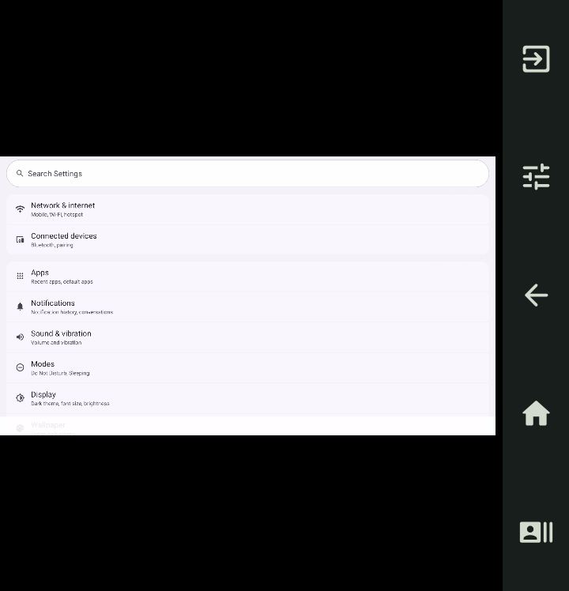

# 自适应全屏布局：源码与原型

日期：2026-09-28。本轮完成全屏布局与原型，按用户最新指示不交付新 APK、不维护版本号。目录中的安装包属于其它批次；本功能需要后续统一打包后再进行真机确认。

交互预览：[flip5-adaptive-preview.html](flip5-adaptive-preview.html)。独立 HTML，无外部依赖，可直接打开；方形、横屏、两种竖屏、340/440dpi 均可切换。仅作本地演示，不会连接手机。

## 布局与操作

- 窄画面：保留左侧投屏与右侧触控板/软件详情的双区布局。
- 宽画面：右侧收为 40dp 五键栏，自上而下为退出、工具、返回、主页、最近任务；剩余宽度全部用于完整等比显示视频。横向视频上下留黑，不能通过拉伸或裁剪消除这些留白。
- 工具：直接触摸、鼠标触控板、软件详情、键盘输入、切换双区布局。工具和详情实色展开；鼠标触控板半透明覆盖展开，以保留视频与光标可见性；展开/收起不改变视频尺寸。
- 鼠标模式只通过触控板操作。收起触控板后，工具键显示鼠标图标并保持选中色，提醒当前输入模式；重新展开即可继续。直接触摸模式操作左侧画面。
- 软件详情保留同一原生页面树，切换布局和收起面板不会重新创建页面。模式、相对光标、页面与会话延续既有状态；布局或控制区域变化会取消正在进行的手势，避免残留按下。
- 手动切回双区后，从顶部详情菜单选择“恢复自动布局”。首次进入仍默认直接触摸。
- 退出沿用调用方现有行为：普通软件入口返回原软件并保留会话；专用一键入口的结束行为由其原有回调负责，不在此改动。

## 切换规则

按视频在当前可用高度下等比显示所需的宽度，计算右侧剩余空间。首次按 120dp 判定；后续低于 112dp 才收为侧栏，高于等于 128dp 才恢复双区，避免临界尺寸变化来回跳动。输入法出现时，判定沿用输入法出现前的可用高度，实际视频仍按缩小后的窗口完整适配。

仅在外屏启用自动侧栏。保留外屏固定字号、内屏原有行为、真实捕获源与系统分辨率/密度。自动投屏启动、窗口路由、超时和恢复守卫未作修改。

## 验证与范围

- 最终源码 `compileDebugKotlin` 成功；本轮执行的 JVM 测试共 55 项通过，其中新增 3 项覆盖视频比例、切换阈值迟滞、完整画面与输入坐标边界。
- 在用户提出暂不打包之前，6 项原生界面测试通过：3 项新布局测试、3 项既有控制测试。覆盖五键顺序/边界、展开后视频尺寸不变、手动布局往返、软件页面仅挂载一次且状态保留、短窗口与禁用远端控制、自定义退出回调、旧鼠标多点接触恢复。
- 同阶段运行 1 项真实会话测试：专用 720×748 模拟器，本机 ADB 与 1920×1080 H.264 视频源；侧栏、工具、鼠标触控板、实际软件详情与退出后会话 ID 不变均通过。测试用虚拟视频源仅是夹具，应用不会因此默认改变捕获源。
- 原型已在浏览器检查工具/鼠标面板展开前后画面尺寸相同、手动双区、竖屏自动恢复、键盘占位后五键保持，以及完整横屏比例。
- 用户要求暂不打包后，仅运行源码编译与 JVM 测试。最后的半透明触控板和工具键模式图标在原型中检查，原生版本已编译，尚未重新生成 APK 做渲染复验。One UI 折叠、实际输入法和真机多指操作仍需最终统一安装包确认。

此前一键入口的真机准备/黑屏问题属于另一项工作，本次不宣称修复。旧版随机二维码测试波动也不在本次修改范围。

## 原生布局示例

以下是本轮真实会话检查截图，720×748。客户端处于中文环境，被投屏的测试设置页为英文。最终触控板半透明外观以原型和源码为准。

