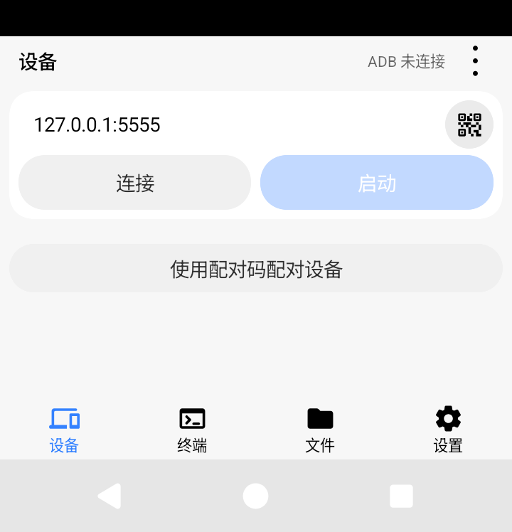
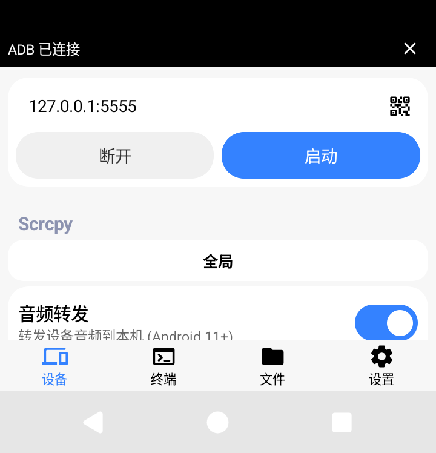
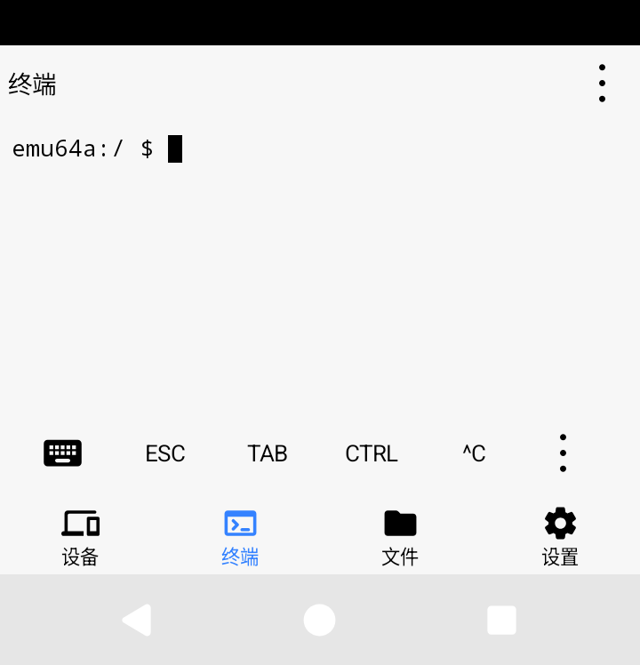
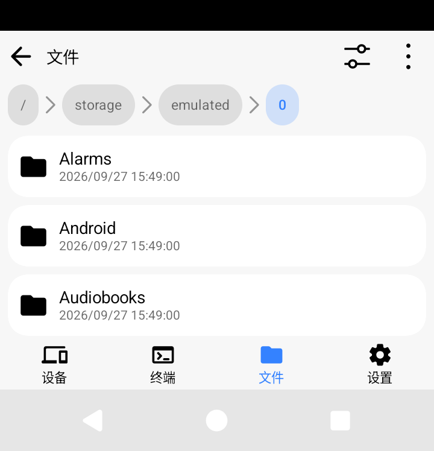
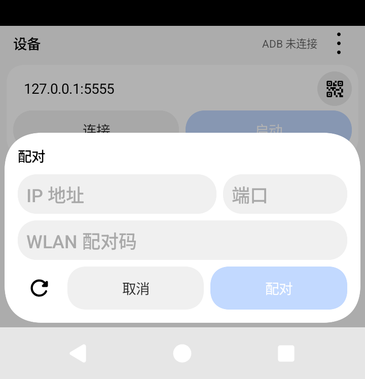
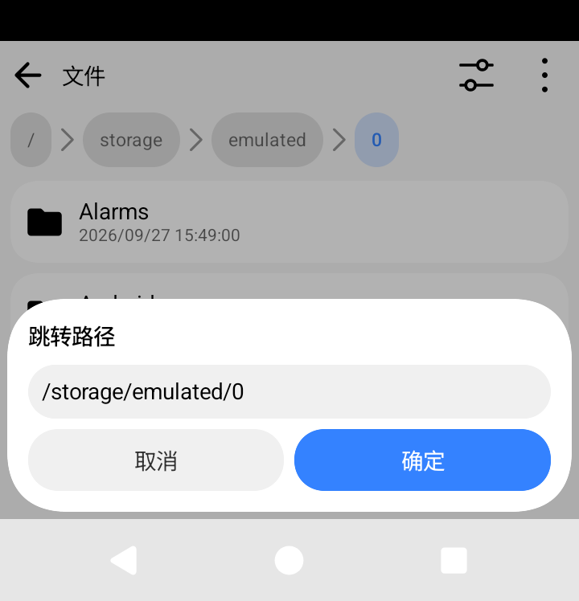
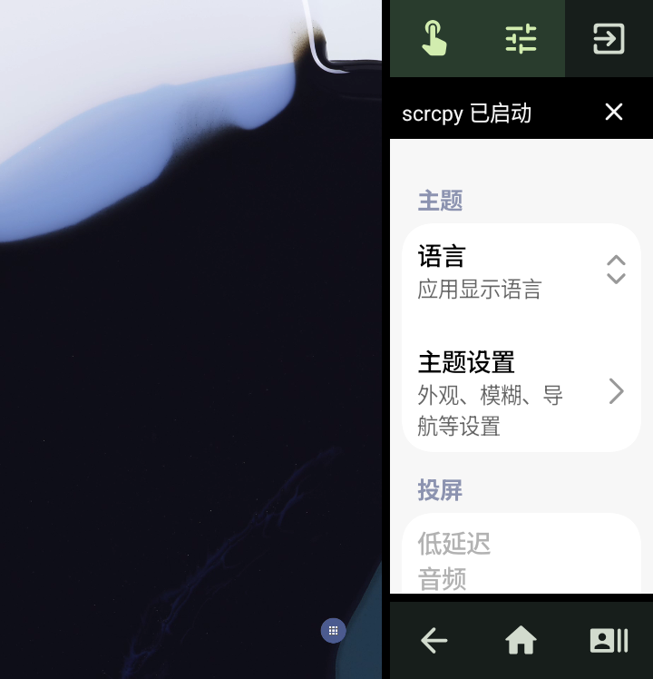
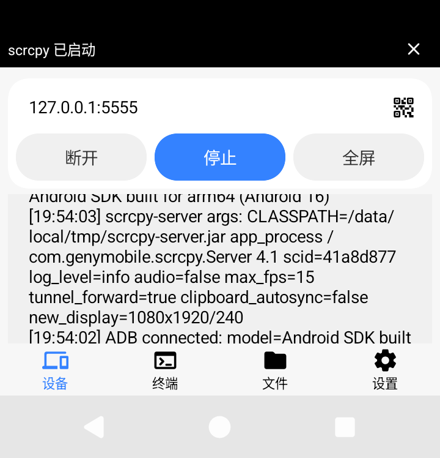

# Flip5 Android 测试记录

日期：2026-09-27。版本：`0.6.6-flip5.3`，versionCode 50，ARM64 Debug。

## 本轮调整

上一版仅做尺寸适配仍保留部分大屏交互，本版按中文外屏工作流程重排。基础控制常驻；高级设置、文件、日志等不定长内容独立滚动。外屏通过局部 Compose Density 固定 fontScale=1，保留系统像素密度；内屏继续跟随原设置，不修改系统字号、分辨率、DPI、内屏电源或捕获源。

| 功能 | 外屏操作与布局 |
| --- | --- |
| 连接、启动 | 地址/扫码与连接/启动共两行，固定顶部；连接成功后同屏启动，无需下滑 |
| 投屏中 | 同一行显示断开、停止、全屏；退出全屏返回这里，保持会话 |
| 配对 | 未连接页直接显示配对入口；地址与端口并排、配对码一行；刷新、取消和配对固定底部 |
| 全屏 | 左侧完整等比画面；触摸直接点左侧、鼠标使用右侧触控板；模式、详情、退出和远端三大键常驻 |
| 详情 | 原生设备、终端、文件、设置与子页；标题选择页面；右侧断开与停止并为一行 |
| 终端 | 一排键盘、ESC、TAB、CTRL、^C、更多；窄详情只保留键盘、^C、更多，全部快捷键仍在菜单 |
| 文件 | 父目录、排序和更多固定顶部；条目压缩为 48dp，名称和时间两行；路径和建文件夹弹窗确认/取消固定底部 |
| 设置与参数 | 紧凑字号、边距、配置标签；高级项、列表和说明可滚动，保留完整功能 |
| 通知、输入 | 通知替换标题条，避免挡住连接/启动；外屏输入时收起标题或底部标签，完成输入显式收起键盘 |

## 问题定位

设备页的固定外屏标题不再使用折叠行为，但列表仍连接折叠标题的 nestedScroll，未初始化的高度限制吞掉了向上拖动。已在应用自有 LazyColumn 中仅为非外屏保留该连接。旧版原始触摸回归记录明确复现滚动值 `0 → 0`；本版验证原始向上滑动使列表移动，同时连接卡片坐标不变，并验证音频开关点击后保存、启动成功解码。

旧版自动化主要用语义 performClick，未覆盖实际点击命中和空闲设备页拖动。本版补充实际 MotionEvent 点击、滑动。测试也处理系统输入法在测试 Activity 之间保留状态的问题，并等待原生弹层动画后截图。

## 验证范围

- Android `assembleDebug`、`assembleDebugAndroidTest`、JVM `testDebugUnitTest` 成功；36 项 JVM 测试通过。
- 专用 720×748 Android 16 模拟器：中文 340dpi、系统字号 100% 的 3 项真实流程测试；中文 440dpi、系统字号 130% 的 9 项外屏测试。外屏固定字号仍为 100%。另有局部 Density 输入 180% 的字号固定回归，以及长表单固定确认区、长菜单和短窗口测试。
- 实际连接模拟器本机 ADB，临时创建 1080×1920 视频源，H.264 解码显示设置；验证连接、启动、开关保存、参数拖动、终端/文件/配对入口、全屏触摸/详情/设置、退出后同一会话 ID 及系统栏恢复。
- 签名校验成功，APK Signature Scheme v2；与 flip5.2 的 Debug 证书相同，versionCode 从 49 升为 50，可覆盖安装。

仅操作此任务专用模拟器。测试视频源、密度和字体调整属于验证夹具，不是应用运行行为。APK 没有默认创建虚拟屏或更改捕获源。输入地址测试按「完成」收起系统键盘后点击连接；不能把 Compose 的键盘可见状态当作键盘实际绘制完成。

原有二维码随机凭据测试曾出现一次 ZXing FormatException，后续完整测试通过，根因未定位，保留监测记录。本轮不宣称修复它。

## 真机仍需确认

One UI 外屏启动器、折叠后的内屏捕获、缺口报告、任务路由、实际多指触感与三星输入法不能由模拟器证明。系统键盘如果占满可用区域，需要先收起键盘；客户端不会修改输入法高度。基础操作无需滚动不等于同时完整显示任意长列表或系统弹窗。外屏固定字体不影响系统界面或被投屏画面的原字号。

## 安装包

[ScrcpyForAndroid-0.6.6-flip5.3-arm64-debug.apk](ScrcpyForAndroid-0.6.6-flip5.3-arm64-debug.apk)，约 38 MiB；应用 ID `io.github.miuzarte.scrcpyforandroid`，Debug 测试签名。

SHA-256：`3bf6eeb986369908afd1318b8e52454e8668207c5b7693de47194b47f2d74b1a`。

## 原生截图

以下来自 720×748、340dpi、中文客户端；无手机外框或图像修改。视频源中的系统设置可能为英文，不是客户端语言。

连接与启动常驻：

连接后同屏启动：

终端与文件：

配对与文件确认：

全屏右侧原生设置：

退出后停止/断开/全屏仍常驻：

